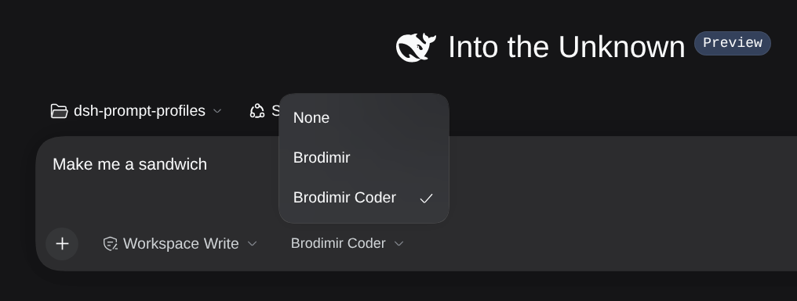
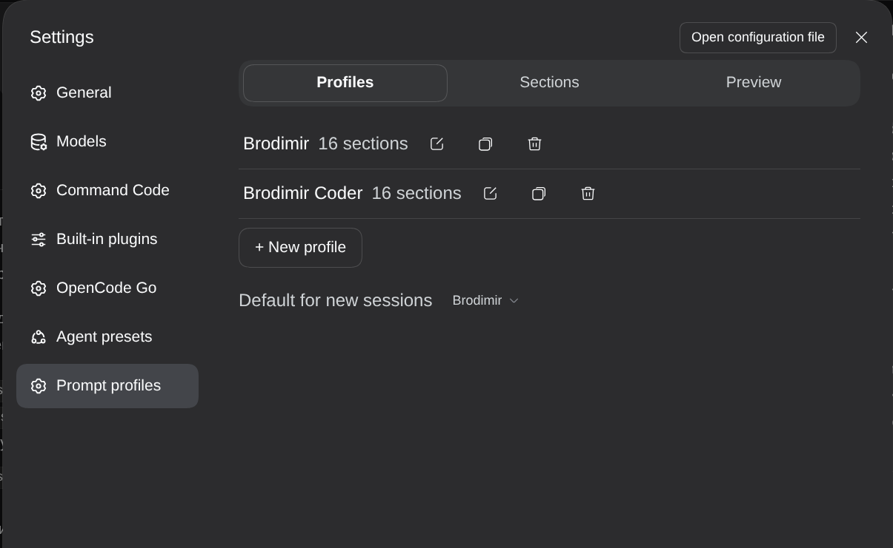
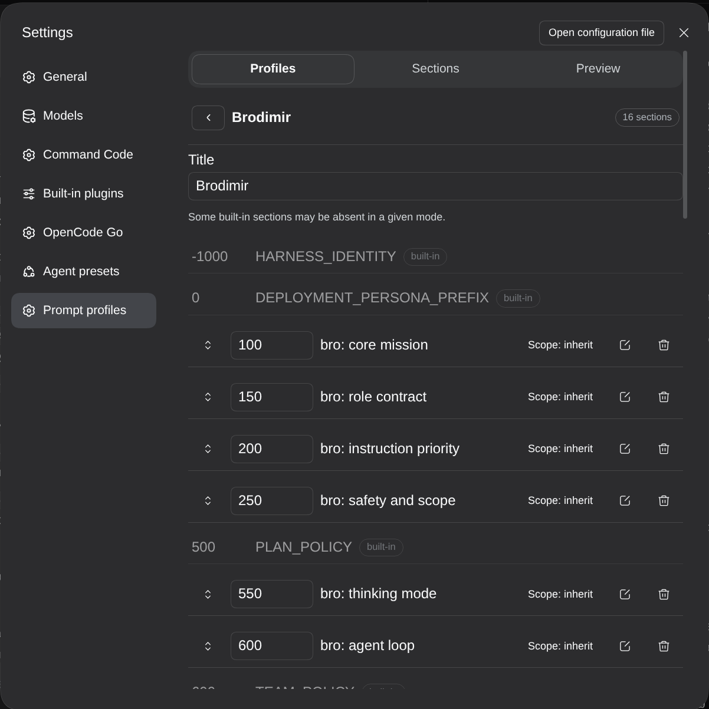
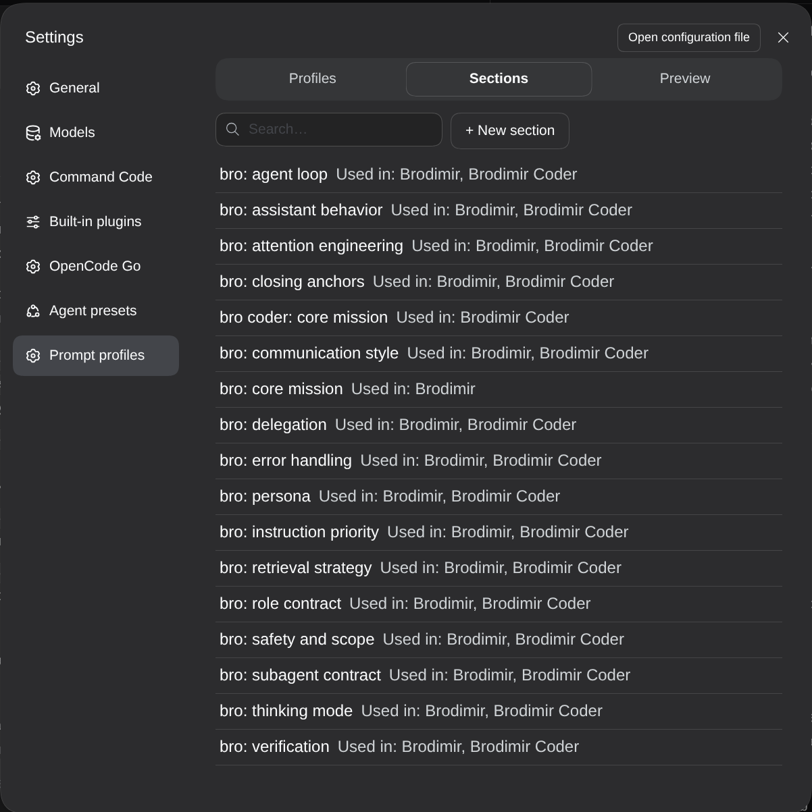
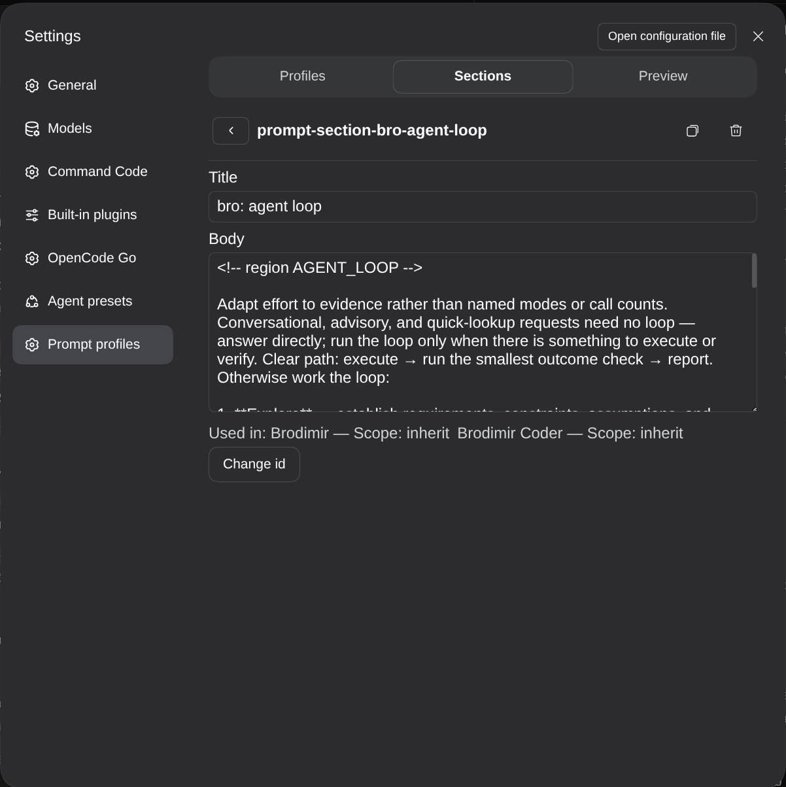

# 📦 @knopki/dsh-prompt-profiles

<div align="center">

<h3>Профили промпта на сессию для DeepSeek Harness: переиспользуемые секции системного промпта, собранные в именованные профили и зафиксированные при старте сессии</h3>

<p align="center">
  <a href="https://www.npmjs.com/package/@knopki/dsh-prompt-profiles"></a>
  <a href="LICENSE"></a>
  <a href="https://github.com/topics/dsh-plugin"></a>
  <a href="#требования"></a>
</p>

<p align="center">
  <a href="README.md"><b>🇬🇧 English</b></a> •
  <a href="README.ru.md"><b>🇷🇺 Русский</b></a> •
  <a href="README.zh.md"><b>🇨🇳 中文</b></a>
</p>

<table align="center">
  <tr>
    <td align="center">
      ⭐ <strong>Если плагин пригодился, поставьте звезду на GitHub.</strong> Так видно, что его стоит развивать.
      <br><br>
      🐛 <strong>Нашли баг или не хватает возможности?</strong> Заводите issue на любом языке. Я читаю все и делаю то, что полезно.
    </td>
  </tr>
</table>

</div>

---



## Обзор

`@knopki/dsh-prompt-profiles` добавляет к профилю DeepSeek Harness вторую ось. Пресеты агентов задают, что это за агент: какие у него инструменты и как он себя ведёт. Профили промпта задают, как этому агенту велено работать. Один и тот же агент с теми же инструментами может быть немногословным ревьюером или специалистом, который держится принятого в проекте стиля, и меняется здесь только профиль, выбранный на старте сессии.

Профиль — это упорядоченный список ссылок на переиспользуемые секции. У каждой ссылки своё место и своя область видимости, поэтому одна секция попадает в разные профили на разные позиции. Профиль выбирают при старте сессии, он фиксируется в промпте этой сессии и больше не пересматривается. Если профиль не выбран, системный промпт не меняется вообще.

Редактор и чип выбора живут в веб-интерфейсе, так что профили собираются без правки промпта руками.

## Возможности

- Секции переиспользуются: фрагмент пишется один раз и подключается в любое число профилей, и в каждой ссылке свой порядок и своя область.
- Область видимости задаётся у ссылки («наследуется», «только основной агент», «только субагенты»): субагент может получить инструкции, которых не видит родительская сессия, а в другом профиле та же секция может остаться доступной всем.
- Порядок предсказуем: секции идут в порядке профиля и встают на устойчивое место среди встроенных секций платформы.
- Фиксация в сессии: профиль разрешается в момент сборки промпта и дальше не меняется, поэтому возобновлённая сессия получает ровно то, с чем начинала.
- Явный отказ: выбор «Нет» — это записанное решение, а не отсутствие значения, и фиксируется он так же, как выбор профиля.
- Без выбранного профиля сборка промпта не трогается совсем.
- Чип в композере: профиль на следующую сессию выбирается рядом с `permission` и `plan`, выбор запоминается по рабочей папке.
- Аккуратные пропуски: неизвестная секция, секция не из этой области, отключённая, пустая или с неразрешимой переменной просто не попадает в промпт. Сессия из-за неё не ломается.
- Редактор с перетаскиванием строк и сортировкой с клавиатуры, поиском, полями «Используется в» и «источник», предпросмотром профиля и автосохранением с задержкой. Параллельная правка распознаётся и перезагружается, а не затирает работу молча.
- Профили лежат строками патча в `cordis.patch.yml`, поэтому их видно в диффе, и ревьюятся они как остальная конфигурация.
- Отдельного транспорта нет: веб-клиент ходит на хост через Remote-канал платформы.
- Интерфейс на английском, русском и китайском.

## Установка

```bash
dsh plugin --profile web add @knopki/dsh-prompt-profiles
```

Из локальной копии репозитория или по git-ссылке:

```bash
dsh plugin --profile web add /path/to/dsh-prompt-profiles
```

`lib/` лежит в репозитории уже собранным, поэтому установка не запускает сборку. Первая установка может подняться через горячую замену модулей, а замену уже установленной копии нужно делать с перезапуском DSH.

Удаление:

```bash
dsh plugin --profile web remove @knopki/dsh-prompt-profiles
```

## Быстрый старт

1. Откройте **Настройки → Промпты → Секции** и создайте секцию: id, название и текст, который должен попасть в промпт.
2. Перейдите на вкладку **Профили**, создайте профиль и добавьте в него секции. Порядок задаётся перетаскиванием за ручку или стрелками, область видимости выбирается в каждой строке.
3. Откройте пустую сессию. Чип рядом с `permission` и `plan` выбирает профиль для новой сессии, и выбор запоминается по рабочей папке.

Сессии, которые уже идут, держат промпт, с которым были зафиксированы, так что профиль применяется к сессиям, запущенным после этого.

## Чип в композере

- Чип показывается только на пустой сессии и только если есть хотя бы один профиль.
- «Нет» явно отказывается от профиля и фиксирует такое решение.
- Выбор запоминается по рабочей папке: следующая сессия в той же рабочей папке стартует с тем же профилем.
- В режимах с полной заменой промпта (например, `minimal`, где пресет ставит `config.complete: true`) движок выбрасывает все секции промпта. Чип помечает такой случай предупреждением, и профиль там ни на что не влияет.

## Редактор

**Настройки → Промпты** — три вкладки: «Профили», «Секции» и «Предпросмотр».

Вкладка «Профили» показывает список профилей с числом секций и задаёт профиль по умолчанию для новых сессий.



Внутри профиля его секции идут в порядке промпта, а между ними видны встроенные секции платформы, так что понятно, куда встанет ваш текст в собранном промпте. Строка двигается перетаскиванием за ручку или вводом числа в поле порядка, область видимости выбирается в строке, иконки в строке открывают правку и удаление. Дублирование и удаление профиля лежат рядом с ним в списке.



Вкладка «Секции» перечисляет все секции вместе с профилями, где они используются, и фильтрует по id и названию.



У секции есть название и текст, правки сохраняются сами через короткую паузу. Секцию из другого бандла можно только отключить: её id не меняется. Переименование id не переписывает ссылки в профилях, и в ответе приходят профили, где остался старый id, чтобы поправить их руками.



Вкладка «Предпросмотр» показывает выбранный профиль на его месте среди встроенных секций промпта и перечисляет всё пропущенное с причиной пропуска.

## Переменные в промпте

В тексте секции могут быть ссылки вида `{{name}}`, например `{{cwd}}`. При фиксации промпта сессии рантайм подставляет их строго: из-за неизвестной или неправильно записанной ссылки секция не попадает в промпт, а не порождает сломанный промпт. Предпросмотр в редакторе намеренно мягче: он показывает такую секцию как пропущенную и объясняет причину, чтобы было видно, что именно отбросит рантайм, а не текст, которого он никогда бы не собрал.

## Где лежат данные

| Данные | Расположение |
|---|---|
| Определения секций и профилей, переопределения по строкам | строки патча профиля в `cordis.patch.yml`, их пишет этот бандл |
| `default` и `lastByWorkspace` | волатильные настройки главной строки `prompt-profiles` |
| Зафиксированные снимки сессий | `$DSH_HOME/storages/prompt_profiles/sessions/<sessionId>.json`, одна запись на сессию |

## Требования

- DSH в диапазоне `>=0.1.7-rc.2 <0.2.1-0` — это окно peer-зависимостей, которое объявляет бандл; `0.2.0-rc.1` — релиз, на котором он проверен.
- Вне этого диапазона DSH отключает плагин, пока вы не выдадите ему exact-version exemption (`dsh plugin allow-version`).
- Плагины самого профиля: на хосте `settings`, `configEditor`, `workspaceRegistry`, `storageDomain`, `typert` и `agentPresets`; в веб-клиенте `@deepseek-ai/dsh-client-ui-settings`, `@deepseek-ai/dsh-client-ui-conversation` и `@deepseek-ai/dsh-client-ui-primitives`.
- Если необязательного сервиса нет, отключается одна возможность. Монтирование бандла это не блокирует.

## Разработка

```bash
mise install          # Node, pnpm и релиз DSH, под который собран бандл
pnpm install --store-dir ./.pnpm-store
pnpm run build        # esbuild-бандлы + декларации tsc в lib/
pnpm test             # хостовые модульные и дифференциальные тесты (node --test)
pnpm run test:client  # клиентский интерфейс на React + jsdom (vitest project client)
pnpm run test:remote  # путь через Remote на настоящем gateway-клиенте (vitest project remote)
pnpm run lint         # biome
pnpm run typecheck    # tsc для src и test
pnpm run check        # typecheck + lint + test + test:client + test:remote + build
```

`lib/` — это результат сборки, и он лежит в репозитории намеренно: установка профиля не должна требовать сборки. Продуктовый контракт описан в [SPEC.md](SPEC.md), ответственность модулей — в их контрактах под [src/](src/).

## Известные ограничения

- Один процесс DSH. Запись из одного процесса DSH согласована; второй процесс DSH, правящий тот же патч профиля, может перезаписать строки или выбор.
- Строгая фиксация. Решение сессии принимается один раз и не пересматривается, включая пустое решение. Сессия, начатая до появления своей записи-снимка, сохраняет свой результат, поэтому профиль можно добавить в неё только новой сессией.

## Лицензия

MIT
